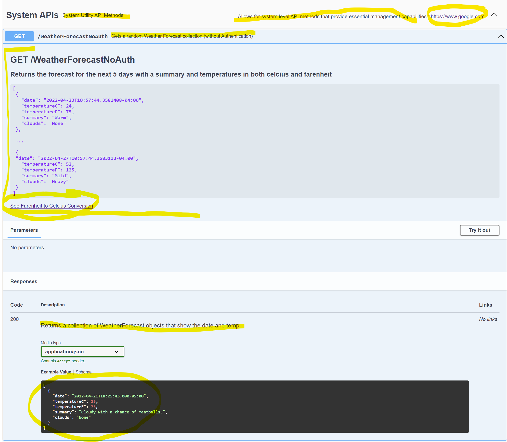
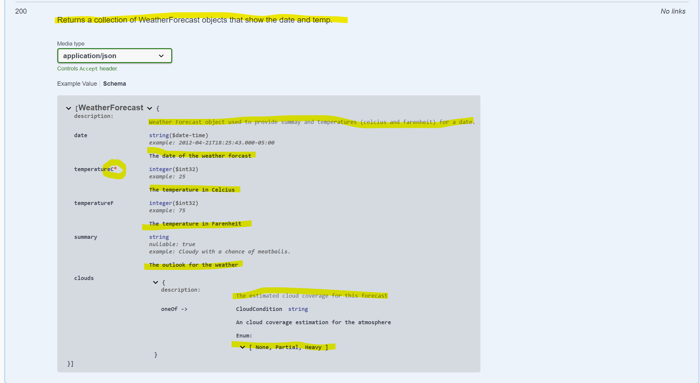
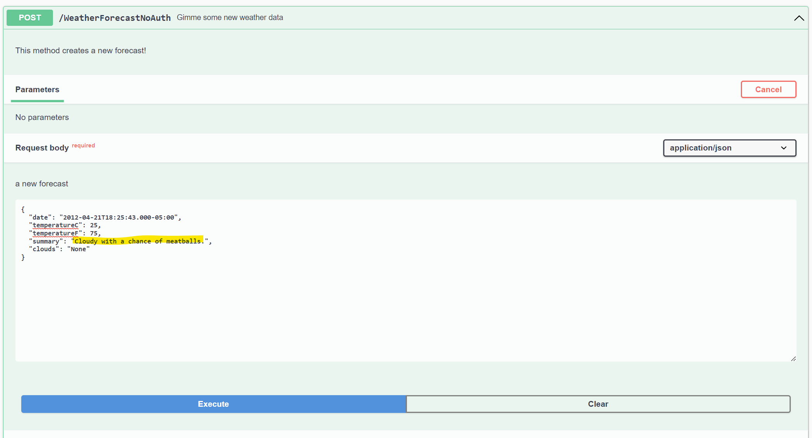

# Documentation Examples

## On the Controller class

```csharp
  [ApiController]
  [Route("[controller]")]
  [OpenApiTag("System APIs", Description = "System Utility API Methods", DocumentationDescription = "Allows for system level API methods that provide essential management capabilities.", DocumentationUrl = "https://www.google.com")]
```

## On Controller methods

```csharp
    /// <summary>
    /// Gets a random Weather Forecast collection (without Authentication)
    /// </summary>
    /// <remarks>
    /// # GET /WeatherForecastNoAuth
    ///
    /// ## Returns the forecast for the next 5 days with a summary and temperatures in both celcius and farenheit
    ///
    /// ```json
    /// [
    ///  {
    ///    "date": "2022-04-23T10:57:44.3581408-04:00",
    ///    "temperatureC": 24,
    ///    "temperatureF": 75,
    ///    "summary": "Warm",
    ///    "clouds": "None"
    ///  },
    ///
    ///  ...
    ///
    ///  {
    ///  "date": "2022-04-27T10:57:44.3583113-04:00",
    ///    "temperatureC": 52,
    ///    "temperatureF": 125,
    ///    "summary": "Mild",
    ///    "clouds": "Heavy"
    ///  }
    ///]
    /// ```
    ///
    /// [See Farenheit to Celcius Conversion](https://www.metric-conversions.org/temperature/fahrenheit-to-celsius.htm)
    /// </remarks>
    /// <response code="200">Returns a collection of WeatherForecast objects that show the date and temp.</response>
    [HttpGet]
    [ResponseCache(CacheProfileName = "cache30")]
    [ProducesResponseType(typeof(IEnumerable<WeatherForecast>), 200, "application/json")]
```

```csharp
namespace TemplateApi
{
  /// <summary>
  /// Weather Forecast object used to provide summay and temperatures (celcius and farenheit) for a date.
  /// </summary>
  public class WeatherForecast : ObjectBase<WeatherForecast>
  {
    /// <summary>
    /// The date of the weather forcast
    /// </summary>
    /// <example>2012-04-21T18:25:43.000-05:00</example>
    public DateTime Date { get; set; }

    /// <summary>
    /// The temperature in Celcius
    /// </summary>
    /// <example>25</example>
    [Required(ErrorMessage = "You must supply a Temperature in Celcius!!!!!")]
    public int TemperatureC { get; set; }

    /// <summary>
    /// The temperature in Farenheit
    /// </summary>
    /// <example>75</example>
    public int TemperatureF => 32 + (int)(TemperatureC / 0.5556);

    /// <summary>
    /// The outlook for the weather
    /// </summary>
    /// <example>Cloudy with a chance of meatballs.</example>
    public string? Summary { get; set; }

    /// <summary>
    /// The estimated cloud coverage for this forecast
    /// </summary>
    public CloudCondition Clouds { get; set; }
  }

  /// <summary>
  /// An cloud coverage estimation for the atmosphere
  /// </summary>
  public enum CloudCondition
  {
    ///<summary>Little or no cloud cover</summary>
    None = 0,
    ///<summary>Partly cloudy with some sunshine</summary>
    Partial,
    ///<summary>Extremely cloudy conditions</summary>
    Heavy = 100,
  }
}
```

## Results in:



## And




## And on POST



## And these definitions

```json
        "WeatherForecast": {
          "type": "object",
          "description": "Weather Forecast object used to provide summay and temperatures (celcius and farenheit) for a date.",
          "additionalProperties": false,
          "properties": {
            "date": {
              "type": "string",
              "description": "The date of the weather forcast",
              "format": "date-time",
              "example": "2012-04-21T18:25:43.000-05:00"
            },
            "temperatureC": {
              "type": "integer",
              "description": "The temperature in Celcius",
              "format": "int32",
              "example": 25
            },
            "temperatureF": {
              "type": "integer",
              "description": "The temperature in Farenheit",
              "format": "int32",
              "example": 75
            },
            "summary": {
              "type": "string",
              "description": "The outlook for the weather",
              "nullable": true,
              "example": "Cloudy with a chance of meatballs."
            },
            "clouds": {
              "description": "The estimated cloud coverage for this forecast",
              "oneOf": [
                {
                  "$ref": "#/components/schemas/CloudCondition"
                }
              ]
            }
          }
        },
        "CloudCondition": {
          "type": "string",
          "description": "An cloud coverage estimation for the atmosphere",
          "x-enumNames": [
            "None",
            "Partial",
            "Heavy"
          ],
          "enum": [
            "None",
            "Partial",
            "Heavy"
          ]
        }
```